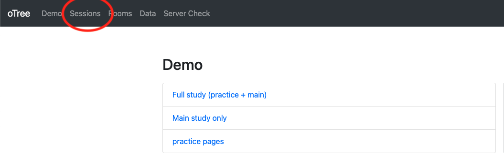
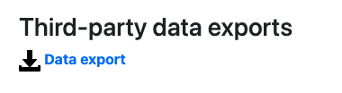
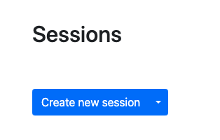
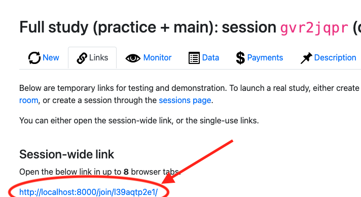
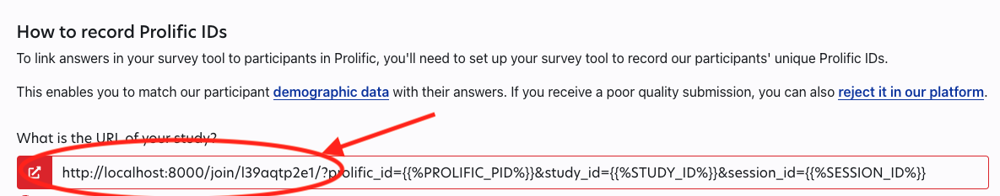
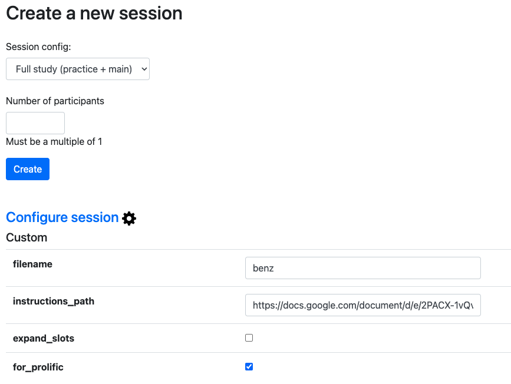
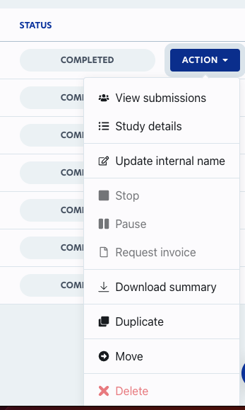

 

# Project description

21 July 2023

# Overall description:

The project is based on oTree version 3.4.0. The version used is a slightly modified one compared to the original 3.4.0 so it can get additional parameters from Prolific.

The modified version of oTree is located at [this github repository](https://github.com/chapkovski/otree_new). 

The path for its installation is already written down in the requirements.txt file of the code of the program.

The code itself is located in the[ GitHub repository here](https://github.com/chapkovski/benzproj).

The running version of the app now is deployed at Heroku (see ‘Deployment’ section below) [at this link.](https://obscure-crag-91489-3093cb8f7eb1.herokuapp.com/demo/)

# Settings

There are several layers of settings in this project. Most of the settings are set via connected google spreadsheet. Some are set when you start an experimental session in oTree.

To start a session you need to access an app and click on the menu ‘Sessions’:

And choose ‘Full study’ option (two other options - “Main study only” and “practice pages” are mostly for internal testing to see how these two parts are functioning. The ‘Full study’ is basically a combination of ‘Practice pages’ app and ‘Main study’).

After clicking on ‘Sessions’ you need to click ‘Create new session’ button:

>>>>>  gd2md-html alert: inline image link here (to images/image2.png). Store image on your image server and adjust path/filename/extension if necessary.  (<a href="#">Back to top</a>)(<a href="#gdcalert3">Next alert</a>) >>>>> 

And then click on ‘Configure settings’ to see all oTree-based settings:

>>>>>  gd2md-html alert: inline image link here (to images/image3.png). Store image on your image server and adjust path/filename/extension if necessary.  (<a href="#">Back to top</a>)(<a href="#gdcalert4">Next alert</a>) >>>>> 

## oTree-based settings:

There are several very important settings that should be correctly set when running a session in oTree:

1. **Session config: **for the real study please choose ‘Full study’
2. **Number of participants: **if this is a real study running on Prolific (not in the lab), set the number of users to the number of real participants x 2 (multiplied by a factor of 2). So if you plan to collect 50 observations, set it to 100. It will solve an issue with possible dropouts. Another important rule is that the data from where the images and sentences are taken has an implicit number of users that are required for this study. This number of users is number of ‘Exp’ values in ‘Exp’ column multiplied by the number of users in each batch (or ‘Exp’). So if there are 10 Exp(erminents) in the data, and each ‘Exp(eriment) contains of 4 unique identifiers apart from 0 which is a dummy participant, then a minimum number of participants should be 4x10=40, and I recommend to set it to 80 for prolific (to deal with drop-outs). If someone sets the number less than 40 in the example above, the system would warn him/her about an error.
3. **filename**: this is the name of the google spreadsheet available at the connected google account. By default it is a file named ‘benz’ but it can be set to any spreadsheet (that contains necessary data of course). This file contains a lot of other settings adjustable for each session (see the next subsection).
4. **Instructions_path: **it is just a link to any publicly available html document. I personally prefer to use google doc, which has an option to publish itself to the web. When you publish a google doc to the web, it provides you with a link that you can plug in there. The default link leads to [this google doc](https://docs.google.com/document/d/1wG4xoIhNvBBXLyRRovHYiSqA7FwO9A118Vc5v6xVZlo/edit?usp=sharing), which can be edited at any time.
5. **expand_slots**: when active (checked), this option triggers the expansion of the available slots at Prolific. That is, when it is on, the system tries to increase the number of available slots for new participants each time a set of participants (equal to number of participants in each Exp/batch) completes the study. This way the data produced by a batch can be used by the next batch.
6. If the study is run on Prolific, keep this box checked (which it is by default). Otherwise the system won’t be able to expand the slots, and won’t redirect participants back to Prolific after the completion of the study. 

## Settings in Excel files:

Most (but not all!) of the settings can be set via any spreadsheet located at the connected google account. The credentials for this google account are the following:

**Credentials**

**Login: **[benzproj@gmail.com](mailto:benzproj@gmail.com)

**Password:** XXXXXX

You can use any properly formatted spreadsheet to set up the study. By default, a file named ‘benz’ is used, and I recommend using this as a template for new files.

The file (in this case[ ‘benz’, which can be found here](https://docs.google.com/spreadsheets/d/15YmkRZS7-gmaEwRVzMIgg0T0IaEB20iGYYeBqxvO-J4/edit?usp=sharing)) contains several worksheets.

1. ‘Settings’ - where the global settings for the study are described
2. ‘Data’ - which is just a copy of a csv file with references to matching, images, conditions all other stuff to display from round to round
3. Set of ‘practice’ worksheets (such as Practice_1, Practice_2, …. Practice_7) to define the look of 7 practice pages. 

The settings have comments describing what each setting does:

<table>
  <tr>
   <td>s3path
   </td>
   <td><a href="https://chappyimgs.s3.us-west-1.amazonaws.com/PicturesMarbles4UM/001_2.png">https://chappyimgs.s3.us-west-1.amazonaws.com/PicturesMarbles4UM/</a>
   </td>
   <td>path to images (in s3 but can be any)
   </td>
  </tr>
  <tr>
   <td>extension
   </td>
   <td>png
   </td>
   <td>the image extention (png, jpg, jpeg, tiff etc)
   </td>
  </tr>
  <tr>
   <td>suffix_1
   </td>
   <td>Madchen finden
   </td>
   <td>the text inserted after 1st field
   </td>
  </tr>
  <tr>
   <td>suffix_2
   </td>
   <td>stones.
   </td>
   <td>the text inserted after 2nd field
   </td>
  </tr>
  <tr>
   <td>
   </td>
   <td>
   </td>
   <td>
   </td>
  </tr>
  <tr>
   <td>allowed_values_1
   </td>
   <td>Each; All; Some; None; Not all; Some but not all; Some and possibly all;something else
   </td>
   <td>allowed values for the first field. Should be divided by semicolon (;)
   </td>
  </tr>
  <tr>
   <td>allowed_values_2
   </td>
   <td>each; all; some; any; none; not all; some but not all; some and possibly all
   </td>
   <td>allowed values for the second field. Should be divided by semicolon (;)
   </td>
  </tr>
  <tr>
   <td>interpreter_choices
   </td>
   <td>bonbon; chocolat; gummy bears
   </td>
   <td>choices for interpreter. Should be divided by semicolon (;)
   </td>
  </tr>
  <tr>
   <td>interpreter_title
   </td>
   <td>Buy sweets:
   </td>
   <td>the title of interpreter table
   </td>
  </tr>
  <tr>
   <td>prefix
   </td>
   <td>
   </td>
   <td>text inserted before the first field
   </td>
  </tr>
</table>

A few comments:

    **s3path**: it is a path to an s3 storage where the images are stored. This can be any storage with a publicly available link and which also contains a subpath called ‘practice’ where the images for practice rounds are stored. Currently the images are stored in S3 bucket, that is made publicly available on the web. But any other hosting solution that allows subfolders (which we need for navigating to the ‘practice’ folder) will work.

    **suffix_&lt;I>, allowed_values_&lt;I>:** if you want to have less or more fields for producer to produce, you can change the number of suffix_ and allowed_values_ parameters. For instance if you add a new field called suffix_3, and a list of values (divided by semicolon) then producer will have three fields to fill in. If there are less ‘allowed_values_’ than suffixes, the system will warn you and won’t let you proceed. If however the allowed_values_ is empty then in a corresponding field a person can insert any value (no restrictions).

    **Interpreter_choices:** should be a list separated by semicolon (;)

## Data:

The data sheet coincides with the original csv file (and you can simply insert the csv file contents there). The principal columns are:

<table>
  <tr>
   <td><strong>Exp</strong>
   </td>
  </tr>
  <tr>
   <td><strong>Producer</strong>
   </td>
  </tr>
  <tr>
   <td><strong>Interpreter</strong>
   </td>
  </tr>
  <tr>
   <td><strong>Condition</strong>
   </td>
  </tr>
  <tr>
   <td><strong><a href="http://Item.Nr">Item.Nr</a></strong>
   </td>
  </tr>
  <tr>
   <td><strong>Item</strong>
   </td>
  </tr>
</table>

Because they define unique combinations within each batch to find corresponding Producer-Interpeter-Condition parameter, and an ‘Item’ which is a combination of Condition and number is a path to an image. 

## Practice file settings

All 7 practice pages have corresponding settings in worksheets named Practice_1, Practice_2 etc. They do not fully define how each practice page looks like because most of them contain javascript that should be edited directly at the html template. You can find html templates for[ each practice page here](https://github.com/chapkovski/benzproj/tree/main/start/templates/start). However all the settings adjustable via google spreadsheet have comments describing what they do (mostly you can change the image number to show, title and html text there).

# Connection to Prolific:

If you want to run a study on Prolific the order is following:

1. You first create a session in oTree with twice as many participants as you actually intend to get (see first section ‘Settings’ in this file). 
2. When you have created the session you are redirected to the page of an active experimental session. The only thing you need there is the **session-wide link:**

    

>>>>>  gd2md-html alert: inline image link here (to images/image4.png). Store image on your image server and adjust path/filename/extension if necessary.  (<a href="#">Back to top</a>)(<a href="#gdcalert5">Next alert</a>) >>>>> 

3. You copy this link, go to a prolific app and insert it there:

    

>>>>>  gd2md-html alert: inline image link here (to images/image5.png). Store image on your image server and adjust path/filename/extension if necessary.  (<a href="#">Back to top</a>)(<a href="#gdcalert6">Next alert</a>) >>>>> 

    Followed by some codes, as you can see.

    In reality I would just go to the current Prolific account, go to the ‘Completed’ studies, find any recent study I ran there, click on ‘Actions’ button and choose ‘Duplicate’. That will create a copy of the previous study with all these codes inserted, and you only need to change the first part (till the question mark):

    

>>>>>  gd2md-html alert: inline image link here (to images/image6.png). Store image on your image server and adjust path/filename/extension if necessary.  (<a href="#">Back to top</a>)(<a href="#gdcalert7">Next alert</a>) >>>>> 

4. WHAT IS IMPORTANT: when you set the number of participants in Prolific, set them to a batch size (in most of the cases it is 4 people). If in settings you checked the box ‘expand_slots’, the system will expand the study further until we get all the necessary data. If you type the amount of people immediately then as soon as more than 4 people arrive, the rest won’t be able to be placed and will be returned to Prolific, so better to avoid it!

# Image storage

As it was said above, images can be stored at any publicly accessible folder. I prefer using Amazon s3 buckets. 

# Exporting data

At the top menu in oTree app you have a section called ‘Data’:

>>>>>  gd2md-html alert: inline image link here (to images/image7.png). Store image on your image server and adjust path/filename/extension if necessary.  (<a href="#">Back to top</a>)(<a href="#gdcalert8">Next alert</a>) >>>>> 

There, at the bottom you have a subsection called ‘Third-party data exports’:

>>>>>  gd2md-html alert: inline image link here (to images/image8.png). Store image on your image server and adjust path/filename/extension if necessary.  (<a href="#">Back to top</a>)(<a href="#gdcalert9">Next alert</a>) >>>>> 

Click there and you will get the data from all the studies collected so far.

# Deployment

The app is currently deployed at Heroku service. Although it can be deployed anywhere (including a local server) with a requirement of Python3.8 being installed on the machine, plus some requirements for oTree (such as PostgreSQL database). 

# Connected Google account (ADVANCED! DO NOT USE WITHOUT NEED!)

_MOST LIKELY YOU WILL NEVER NEED THIS SECTION SO IT IS FOR FUTURE DEVELOPERS:_

Right now the whole app is connected to a dedicated google/gmail account [benzproj@gmail.com](mailto:benzproj@gmail.com) (see credentials above). However it is possible to use another google account. The program uses a gspread python package which has a detailed documentation how to connect it to a new account.

The current heroku app keeps google credentials needed to connect via gspread to our google sheets in so called environment variables, so they need to be adjusted if new account should be connected.

The parameters to set are:

"GOOGLE_CLIENT_EMAIL": "XXX",

 "GOOGLE_CLIENT_ID": "XXX",

 "GOOGLE_PRIVATE_KEY": "XXX",

 "GOOGLE_PRIVATE_KEY_ID": "XXX",
